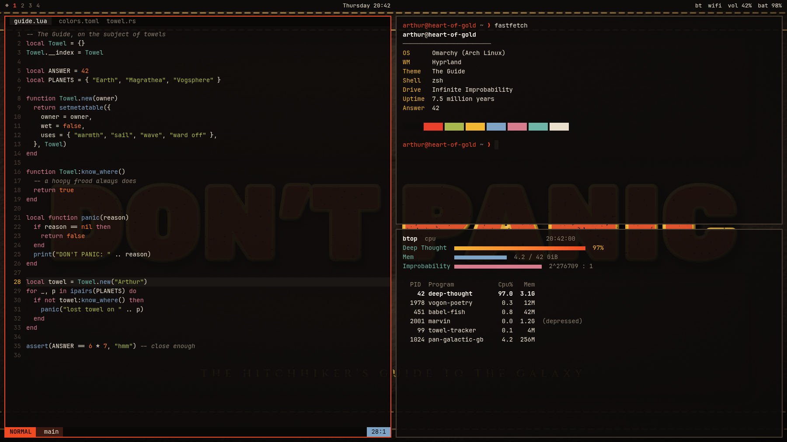

# The Guide

A warm-black Omarchy theme in red-orange and gold, styled after the cover of a well-worn copy of *The Hitchhiker's Guide to the Galaxy*.



## Install

```bash
omarchy theme install https://github.com/adampog/The-Guide
```

Or open **Style → Theme → Install** from the Omarchy menu and paste the URL.

## What's inside

| File | What it does |
|---|---|
| `colors.toml` | The palette. Omarchy generates terminal, Hyprland, Neovim, VS Code, btop and the rest from it |
| `backgrounds/` | Six wallpapers at 3440×1440 (ultrawide), with the important parts in the centre so 16:9 screens crop cleanly |
| `unlock.png` | "DON'T PANIC" logo for the boot and disk-unlock screen |
| `icons.theme` | Yaru-red icons, to match the accent |
| `preview.png`, `preview-unlock.png` | Theme picker previews |

## Palette

| | | |
|---|---|---|
| Background | `#0e0c0b` | black leather |
| Accent | `#f04a23` | red-orange cover lettering |
| Yellow | `#f2b632` | gold trim |
| Orange | `#ff7a2f` | |
| Foreground | `#e9dfcc` | old parchment |
| Green | `#a9b84c` | |
| Cyan | `#6fb5a6` | |
| Blue | `#7fa3c4` | |
| Magenta | `#d77b8f` | |

## Wallpapers

1. **Carry a Towel**: a wartime-style propaganda poster.
2. **Forty-Two**: the Answer, in gold-rimmed numerals among the orbits.
3. **The Babel Fish**: a retro labelled cutaway diagram.
4. **Infinite Improbability Drive**: a matching cutaway, powered by one nice hot cup of tea.
5. **The Guide**: a close-up of the leather-bound cover itself.
6. **Mostly Harmless**: 1980s home-computer game box art.

## Rebuilding the art

Every image is a self-contained HTML file in `tools/`, rendered with headless Chromium:

```bash
tools/render.sh                 # all wallpapers, or: tools/render.sh 3-babel-fish
```

The pages load fonts from Google Fonts, so rendering needs a network connection. Wallpapers 5 and 6 were compressed after rendering with
`magick <file> -strip +dither -posterize 128 -define png:compression-level=9 <file>`.
`preview.png` is a screenshot of `tools/preview.html` at 1800×1012, `preview-unlock.png` of `tools/preview-unlock.html` at 1920×1080, and `unlock.png` of `tools/unlock.html` at 800×188 on a transparent background.

## Credits

A fan tribute to Douglas Adams' *The Hitchhiker's Guide to the Galaxy*. Not affiliated with or endorsed by the Adams estate or any rights holders. All artwork here is a tribute to the novels.
